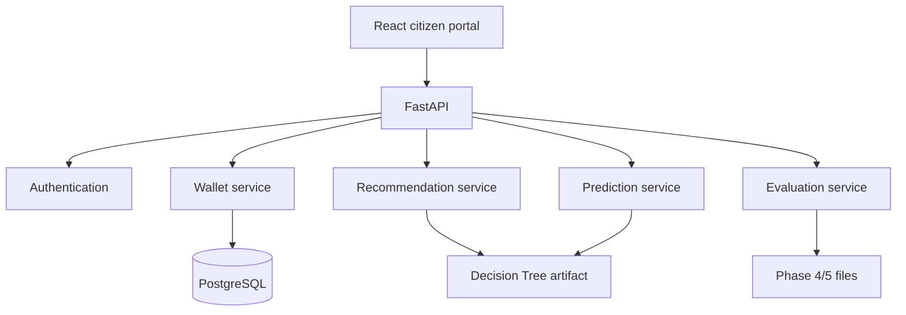
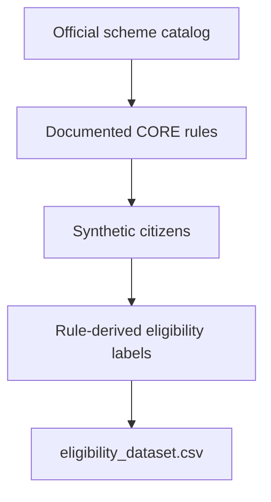
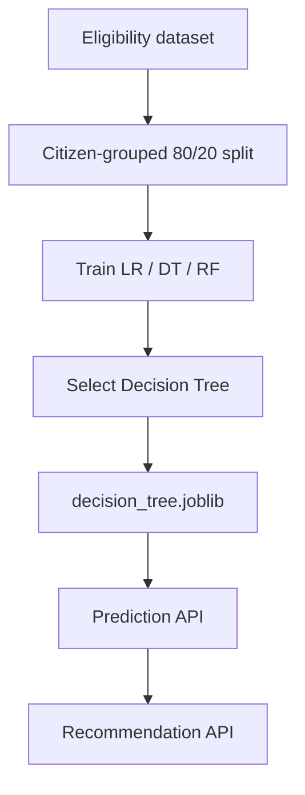

# Final system architecture

Academic research prototype for **State Government Sponsored Scheme Eligibility Predictor Engine Utilizing Unified Socio-Economic Data Wallets**.

Predictions are not official government eligibility decisions.

## 1. Problem

Citizens often struggle to discover which Tamil Nadu welfare schemes may apply to them. Official rules are spread across departments. This project studies whether a unified socio-economic profile and a supervised model can rank a small CORE set of schemes for academic demonstration.

## 2. Proposed solution

A citizen (or reviewer) stores socio-economic fields in a user-owned data wallet. FastAPI scores the six CORE schemes with a saved Decision Tree, returns predicted-eligible schemes with explanations, and links to official catalog sources. A public evaluation dashboard presents the existing Phase 4/5 experiment.

## 3. Unified Socio-Economic Data Wallet

PostgreSQL table `citizen_profiles` stores only socio-economic fields plus `user_id`. It does not store eligibility labels, model scores, Aadhaar numbers, or government identifiers. Ownership is enforced by JWT. One wallet per user.

## 4. Data pipeline

The catalog has 13 official schemes. Six are CORE for ML. Citizens and labels are synthetic.

## 5. ML pipeline

The prototype model is the Decision Tree. Near-perfect test scores are expected because the model receives the same inputs the rule engine used.

## 6. Recommendation flow

User or wallet profile → feature processing → Decision Tree for each CORE scheme → keep predicted-eligible schemes → rank by model probability → attach official catalog text and source URL.

## 7. Backend

FastAPI `12.0.0`. Public routes: `/health`, `/predict`, `/recommend`, `/schemes`, `/model-info`, `/evaluation/*`. Authenticated routes: `/auth/*`, `/wallets/*`. CORS is limited to local Vite origins.

## 8. Frontend

React + TypeScript + Vite + Tailwind. Routes: `/`, `/check`, `/results`, `/schemes`, `/evaluation`, `/login`, `/register`, `/wallet` (protected). API base URL is `VITE_API_BASE_URL`.

## 9. Database

PostgreSQL. Tables: `users`, `citizen_profiles`. Tests use `TEST_DATABASE_URL` only. `.env` is gitignored.

## 10. Authentication

Register / login with Argon2 password hashes and HS256 JWTs. The secret comes from the environment. Login uses one message for unknown email and wrong password. This is not government identity verification.

## 11. Evaluation

Public read-only APIs read existing Phase 4/5 artifacts. The dashboard does not retrain models or expose users or wallets.

## 12. Limitations

- Synthetic citizens and rule-derived labels
- No real government application outcomes
- CORE schemes only
- Predicted eligibility is not approval
- No Aadhaar, OTP, payment, deployment, LLM, or government API integration
